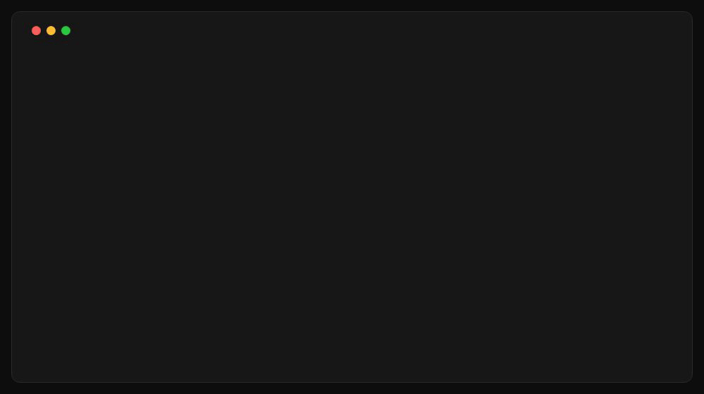

<p align="center">
  <a href="https://homewend.app">
    
  </a>
</p>

<h1 align="center">Homewend</h1>

<p align="center">
  <strong>Google Photos, on your own disk.</strong><br />
  The open-source Google Photos downloader.
</p>

<p align="center">
  <a href="LICENSE"></a>
  
</p>

<p align="center">
  <a href="https://homewend.app"><strong>homewend.app</strong></a> ·
  <a href="https://homewend.app/faq/">FAQ</a> ·
  <a href="https://homewend.app/guides/">Guides</a> ·
  <a href="https://homewend.app/why/">Why Homewend</a> ·
  <a href="https://homewend.app/#join">Join the waitlist</a>
</p>

<p align="center">
  
</p>

---

A large Google Photos library comes out of Google Takeout as a long list of
separate archives, each several gigabytes. Homewend asks Google for the
export, waits while Google prepares it, brings every archive down by itself,
picks up where it stopped if the connection drops, puts your photos in plain
folders on your disk, and counts every file against the list Google puts in
the export.

This repository is the engine of the Homewend desktop app, and its command
line. The desktop app is on its way — [join the waitlist](https://homewend.app/#join)
for one email when it is ready. The command line works today.

- **You sign in to Google in your own browser.** Homewend never sees your password.
- **Plain folders, on your disk.** Sorted by date, with your albums beside them, readable without Homewend.
- **Your photos are never modified.** No edits, no rewritten dates, no conversions.
- **Nothing passes through our servers.** Your photos go from Google to your disk.

---

## Installation

```bash
curl -fsSL https://raw.githubusercontent.com/ronalder100/homewend/main/install.sh | sh
```

This downloads the latest release for your machine, checks it against the
release's checksums, and puts `homewend` in `~/.local/bin` (set
`HOMEWEND_INSTALL_DIR` to put it somewhere else). Nothing needs root.

**From source** (Go 1.25 or later):

```bash
git clone https://github.com/ronalder100/homewend.git
cd homewend
go build -o homewend ./cmd/homewend
```

**You need:**

- macOS or Linux. Windows is not supported yet.
- Chrome, Chromium, Brave or Edge, for signing in to Google.
- Room on the disk for your library, plus one archive while it is unpacked.
  Homewend checks before it starts.

---

## Quick start

```bash
# 1. Sign in to Google, once, in a browser window Homewend opens
homewend login

# 2. Ask Google for one year of photos, download it, check it
homewend get --year 2025 --library ~/Pictures/Homewend

# 3. The same, for everything
homewend get --library ~/Pictures/Homewend
```

Start with one year: it is small, and Google prepares it in minutes. All of
your photos can take Google hours to prepare, and a long time to download.
Stop Homewend at any point with `Ctrl-C` and run the same command again: it
carries on where it was.

---

## Signing in

```bash
homewend login
```

This will:

1. Open Chrome, Chromium, Brave or Edge — your default browser if it is one of
   these — on a profile that belongs to Homewend, separate from your own.
2. Wait while you sign in to Google there.
3. Close the window once you are in.

The session stays in that profile, and every other command reads it from
there:

| System | Profile |
|---|---|
| Linux | `~/.config/homewend/profile` |
| macOS | `~/Library/Application Support/homewend/profile` |

The first time Homewend downloads from an account, it opens the browser on
your export and asks you to **click Download on the first part**, and to enter
your password if Google asks for it. This happens once per account; the window
closes by itself once the download starts.

When a command says the session expired, run `homewend login` again, then the
same command.

To use a browser Homewend does not find by itself:

```bash
BROWSER_BIN=/path/to/chromium homewend login
```

---

## Commands

Every command has its own help: `homewend help <command>`, or
`homewend <command> --help`.

### Get your photos

**One year**
```bash
homewend get --year 2025 --library ~/Pictures/Homewend
```

**All of them**
```bash
homewend get --library ~/Pictures/Homewend
```

Asks Google Takeout for an export of your Google Photos, waits while Google
prepares it, downloads every part, puts the photos in the library and counts
them against the manifest. Google also sends you an email when the export is
ready; you do not need to do anything with it.

It is safe to stop and run again at any time: the export already asked for is
never asked for twice, and each download resumes from the byte where it
stopped. If the network drops, Homewend waits for it to come back.

If Google does not offer the year you asked for, Homewend says so and lists
the years and albums it does offer.

**Options:**
- `--library DIR` — where your photos go (required)
- `--year YYYY` — only this year (default: all of your photos)
- `--profile DIR` — browser profile to use (default: the one `login` made)
- `--json` — one JSON object per line, for scripts

### Download an export you asked for yourself

```bash
homewend fetch --library ~/Pictures/Homewend
```

If you created the export on [Google Takeout](https://takeout.google.com)
yourself, `fetch` finds the newest one that is ready and does the rest: every
part, the library, the count.

**Options:** `--library DIR` (required), `--profile DIR`, `--json`.

### Check a library again

```bash
homewend verify --library ~/Pictures/Homewend --job <export id>
```

Counts the library again against the manifest of an export already downloaded
into it, year by year, and names every file that is missing. It downloads
nothing and changes nothing. The export id is the name of the export's folder
under `~/Pictures/Homewend/.homewend/`.

**Options:** `--library DIR` (required), `--job ID` (required), `--json`.

### Version

```bash
homewend version
```

---

## What lands on disk

```
Homewend/
├── 2019/
│   ├── 07/
│   │   └── IMG_1234.jpg
│   └── unknown-month/        Google knows the year, not the month
├── albums/
│   └── Greece 2019/
│       └── IMG_1234.jpg      the same file as 2019/07/IMG_1234.jpg, not a copy
├── undated/                  photos nobody could put a date on
└── .homewend/                Homewend's own files
    ├── metadata/             Google's .json for each photo, beside nothing else
    ├── catalog.db            an index: delete it and it is rebuilt from the files
    └── <export id>/          progress of each export, and its manifest
```

- **By date, in your timezone.** The date comes from Google's metadata, or from
  the photo itself.
- **Albums take no extra space.** A photo in an album is a hard link to the
  same file; where the disk does not allow links, it is copied.
- **Each photo is stored once.** Duplicates are recognised by their content,
  not their name. Two different photos with the same name are both kept.
- **The archives do not pile up.** Each one is unpacked as it arrives and
  deleted once it is recorded as unpacked, so the disk holds your library and
  one archive, not two copies of everything.
- **Google's metadata is kept, never merged into the photos.** The `.json`
  files under `.homewend/metadata/` hold the description, the place and the
  people, exactly as Google sent them.

---

## What Homewend checks, and what nobody can

At the end of every `get`, `fetch` and `verify`, Homewend counts the photos in
your library against the list Google itself puts in the export, file by file
and year by year:

```
declared <files in the manifest>, on disk <found>, missing <not found>
  <year>  <found> of <declared>
  ...
  missing: <the name of each missing file>
```

Every missing file is named. What this proves is that **everything Google put
in the export reached your disk**. Whether Google put your whole library in the
export is something no one outside Google can check, and Homewend never claims
it.

---

## Scripting

With `--json`, every command prints one JSON object per line: progress events
as they happen, then the result.

```bash
homewend get --year 2025 --library ~/Pictures/Homewend --json \
  | jq -c 'select(.verification) | .verification | {declared, present, missing}'
```

| Line | When |
|---|---|
| `{"event": {...}}` | progress, by `stage`: `sign-in`, `first-download`, `request`, `waiting`, `download`, `downloaded`, `short`, `retry`, `unpack`, `place` |
| `{"organized": {...}}` | photos placed, bytes, duplicates skipped, undated |
| `{"verification": {...}}` | `declared`, `present`, `missing`, per-year counts |
| `{"error": "...", "exit": N}` | what went wrong, and the exit code |

**Exit codes:**

| Code | Meaning |
|---|---|
| `0` | done: everything Google declared is on disk |
| `1` | an error; the message says which |
| `2` | finished, but something is missing: the files are named |
| `3` | not signed in, or the session expired: run `homewend login` |

---

## When something goes wrong

| Message | What to do |
|---|---|
| `the Google session expired` | Run `homewend login`, then the same command. |
| `the browser was closed before sign-in finished` | Run `homewend login` again and finish signing in. |
| `no Chrome, Chromium, Brave or Edge found` | Install one, or set `BROWSER_BIN` to its path. |
| `not enough space for this export` | Free the space it names, or choose a library on a bigger disk. |
| `no export is ready on Google Takeout yet` | For `fetch`: wait for Google's email, or use `get`, which waits for you. |
| `Google Takeout offers no export of <year>` | Pick one of the years or albums it lists. |
| `the browser was closed before a download started` | Run the same command again, and click Download on the first part. |
| `stopped: run the same command again` | Nothing is lost: run it again to carry on. |

---

## Quick reference

```bash
homewend login                                     # sign in, once
homewend get --year 2025 --library DIR             # one year: ask, download, check
homewend get --library DIR                         # all of your photos
homewend fetch --library DIR                       # an export you made yourself
homewend verify --library DIR --job ID             # count a library again
homewend <command> --json                          # JSON lines, for scripts
homewend help <command>                            # help for a command
homewend version                                   # the version
```

---

## How it works

- [`docs/principles.md`](docs/principles.md) — the rules the code follows
- [`docs/architecture.md`](docs/architecture.md) — how the download works, and why
- [`docs/engine.md`](docs/engine.md) — the layout of the code, and why Go

---

## License

[AGPL-3.0](LICENSE). Free to use, read, change and pass on. Running Homewend on
your own computer or your own NAS asks nothing of you; running a changed
version as a service for others means publishing your changes. More in
[`docs/engine.md`](docs/engine.md#licence).

---

<p align="center">
  <a href="https://homewend.app">homewend.app</a> · © 2026 Homewend<br />
  Not affiliated with Google. Google Photos is a trademark of Google LLC.
</p>
