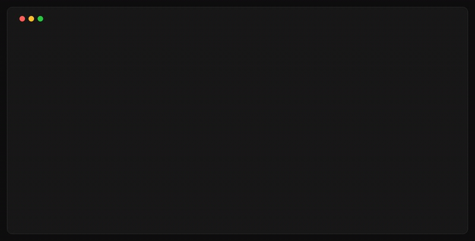

<p align="center">
  <a href="https://homewend.app/?src=github">
    
  </a>
</p>

<h1 align="center">Homewend</h1>

<p align="center">
  <a href="LICENSE"></a>
  
</p>

<p align="center">
  <strong>Google Photos, on your own disk.</strong>
</p>

<p align="center">
  Proudly in the terminal. <a href="https://homewend.app/?src=github#join">Desktop app soon.</a>
</p>

<p align="center">
  <a href="https://homewend.app/guides/?src=github"><strong>Guides »</strong></a>
  ·
  <a href="https://homewend.app/faq/?src=github">FAQ</a>
</p>

<p align="center">
  
</p>

Google Photos to your disk in one click: no zips to babysit, no download to restart by hand. Homewend does the heavy lifting; you get your photos in plain folders, sorted by date and album. Open source, and nothing passes through our servers.

## 🚀 What's next

- **Windows version.**
- **[Desktop app](https://homewend.app/?src=github#join):** one click, pick your albums, see your library.

## ✨ Features

- **One command, start to finish.** Asks Google Takeout for the export, waits, downloads, unpacks, checks.
- **Resumes.** Lose the network or put the computer to sleep: it carries on by itself. After a restart, run the same command again: it picks up from the byte where it stopped.
- **Plain folders.** By date, albums beside them, readable without Homewend.
- **Verified.** Every file checked against its checksum once on your disk, and counted against the list Google puts in the export; anything missing is named.
- **Untouched.** Photos are never modified; Google's `.json` is kept beside them, never written into them.
- **Private.** Google → your disk, no server between.

## ⚡ Quick start

Install Homewend (macOS or Linux):

```bash
curl -fsSL https://homewend.app/install.sh | sh
```

Sign in to Google. A browser window opens; you sign in there, once:

```bash
homewend login
```

Download one year of photos, to try it:

```bash
homewend get --year 2025 --library ~/Pictures/Homewend
```

Download everything:

```bash
homewend get --library ~/Pictures/Homewend
```

Good to know:

- Google needs time to prepare your photos: minutes for a year, hours for everything. Leave the terminal open.
- If the computer restarts, run the same command again. Sleep is fine: it carries on when the computer wakes.
- The first time, a browser window opens on your export: **click Download on the first part**. Only once.
- You need Chrome, Chromium, Brave or Edge. Windows is not supported yet.
- You need room for your library plus one zip. Homewend checks before it starts.
- The installer checks the download and puts `homewend` in `~/.local/bin`. No root needed.
- From source: `go build ./cmd/homewend` (Go 1.25+).

## Homewend vs. Takeout by hand

| | Google Takeout by hand | Homewend |
|---|---|---|
| **A big library** | A list of Download buttons, one per zip, to click by hand one by one. A 344 GB library came as 159 zips. | One command downloads them all, one after another. |
| **The connection drops** | No resume: you click Download and start that zip again. | It carries on from where it stopped. |
| **What you get** | Zips, with photos and Google's `.json` files mixed together. | Photos in folders by date, and by album. |
| **Did everything arrive?** | Hard to tell: Google's list has over 100,000 lines. | Every file is checked against Google's list. Anything missing is named. |

## Commands

| Command | What it does |
|---|---|
| `login` | Sign in to Google, in a browser profile that belongs to Homewend |
| `get` | Ask Google for an export, download it, check it |
| `fetch` | Download an export you made yourself on Takeout |
| `verify` | Count a library again against its export |
| `version` | Print the version |
| `help <command>` | Flags and examples |

`--json` on any command prints one JSON object per line, for scripts.
Exit codes: `0` done · `1` error · `2` files missing, named · `3` not signed in or session expired: run `homewend login`.

## On your disk

```
Homewend/
├── 2019/
│   ├── 07/
│   │   └── IMG_1234.jpg
│   └── unknown-month/
├── albums/
│   └── Greece 2019/
│       └── IMG_1234.jpg
├── undated/
└── .homewend/
```

- One folder per year and month. `unknown-month/` when Google knows only the year.
- Albums link to the same photos: no extra space, where the disk allows links.
- `undated/` for photos with no date at all.
- `.homewend/` keeps Google's `.json` files, the catalogue and the progress.

## How Homewend works with Google

- It uses **Google Takeout**, Google's own export of your data.
- You sign in **in your own browser**. Homewend never sees your password.
- It proves everything Google put in the export reached your disk. It cannot prove Google exported your whole library; nobody outside Google can.

In detail: [`architecture.md`](docs/architecture.md) · [`principles.md`](docs/principles.md) · [`engine.md`](docs/engine.md)

## License

[AGPL-3.0](LICENSE): free to use on your computer or NAS; run a changed version as a service and you publish your changes.
Not affiliated with Google. Google Photos is a trademark of Google LLC.
